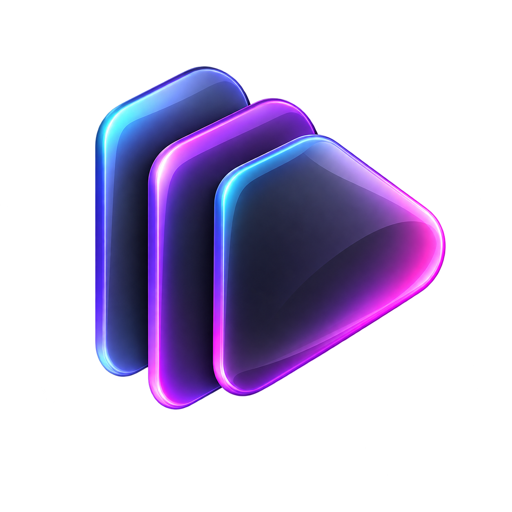

  
  <h1>AutoDeck</h1>
  
<strong>Запускай рабочие сценарии одной кнопкой</strong>

  
Красивый Windows-лаунчер для ежедневных наборов программ.

  
  
  

## Зачем нужен AutoDeck

Каждый день мы открываем одни и те же программы: редактор, браузер, мессенджер, OBS, музыку и рабочие инструменты. AutoDeck объединяет их в сценарии. Выбираете сценарий — и все программы запускаются последовательно с заданной паузой.

## Возможности

- Сценарии с понятными названиями и набором иконок.
- Запуск всех программ одной кнопкой с отображением результата по каждому пункту.
- Добавление программ вручную, через выбор `.exe` и через реальный поиск установленных Windows-программ.
- Корректный запуск приложений, которым нужен собственный рабочий каталог.
- Автозапуск AutoDeck при входе в Windows.
- Автозапуск выбранного сценария вместе с Windows.
- Перестановка и удаление программ внутри сценария.
- Настройка задержки между запусками и поведения при закрытии окна.
- Сворачивание в системный трей.
- Экспорт и импорт сценариев в JSON.
- Адаптивный интерфейс, тёмная glassmorphism-тема и авторская иконка.

## Установка

Откройте страницу [Releases](https://github.com/Abynarc/AutoDeck/releases) и скачайте подходящий вариант:

| Устройство | Файл |
| --- | --- |
| Windows на Intel или AMD | `AutoDeck-1.0.5-win-x64.exe` |
| Windows на ARM/Snapdragon | `AutoDeck-1.0.5-win-arm64.exe` |

`.zip` и `.rar` версии содержат тот же установщик и удобны для ручной передачи файла.

Установщик по умолчанию предлагает `C:\Program Files\AutoDeck`, но позволяет выбрать другой каталог. Приложение не подписано цифровым сертификатом, поэтому Windows SmartScreen может показать предупреждение неизвестного издателя.

## Как пользоваться

1. Создайте сценарий кнопкой `+`.
2. Назовите его и выберите иконку.
3. Добавьте программы в нужном порядке.
4. Нажмите **Запустить всё**.
5. При необходимости включите автозапуск приложения или сценария в настройках.

## Технологии

TypeScript, React, Electron, Vite, Zustand и electron-builder.
